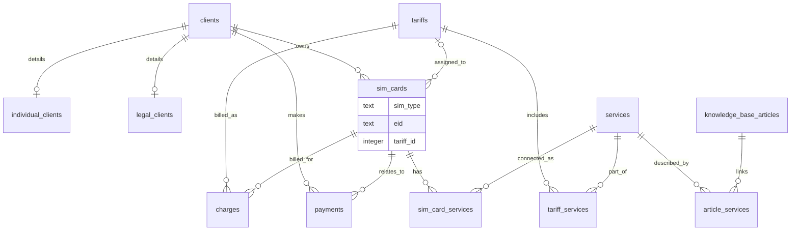

# Архитектура

## Модель данных

Учебная БД оператора мобильной связи. Центральная сущность — **клиент** (`clients`), который может быть физическим или юридическим лицом. Детали хранятся в `individual_clients` или `legal_clients`.

**SIM-карты** (`sim_cards`) привязаны к клиенту (или свободны). Поддерживаются physical и eSIM (`sim_type`, `eid` с миграции 003).

**Тарифы** (`tariffs`) задают абонплату и состав услуг через `tariff_services` (M:N с `services`). SIM-карта может ссылаться на тариф через nullable `sim_cards.tariff_id` (миграция `005`).

**Услуги** (`services`) подключаются к SIM через `sim_card_services` с историей и ценой на момент подключения.

**Начисления** (`charges`) — неизменяемый помесячный снимок абонплаты по SIM (`tariff_name`, `amount` на момент начисления). Связи с `payments` нет: это начисленная, а не оплаченная выручка.

**Платежи** (`payments`) относятся к клиенту; опционально к SIM-карте. Триггеры гарантируют, что SIM в платеже принадлежит тому же клиенту.

**База знаний**: `knowledge_base_articles` связана с услугами через `article_services`.

## ERD

Актуальная диаграмма (включая тарифы и начисления, миграция `005`):

Связи: `tariffs` 1:N `sim_cards`; `tariffs` M:N `services` через `tariff_services`; `sim_cards` 1:N `charges`; `tariffs` 1:N `charges`.

Полная версия: [erd.md](erd.md) (при расхождении ориентируйтесь на `schema.sql`).

## Ключевые решения

- **SQLite** — один файл, без сервера; подходит для учебного проекта и локальных проверок.
- **Миграции** — нумерованные SQL в `migrations/`, журнал в `migration_history`; откат через `migrations/down/`.
- **schema.sql** — эталон «как должно быть»; миграции воспроизводят эволюцию.
- **Триггеры** — тип клиента в detail-таблицах, согласованность платежей и SIM.
- **Seed** — идемпотентный `INSERT OR IGNORE`; повторная загрузка безопасна.
- **Аудит** — read-only SQL в `queries/integrity/`; схему не меняет, ловит логические нарушения, которые FK не покрывают.
- **Тарифы и начисления** — `tariff_id` у SIM nullable; архивный тариф нельзя назначить (триггеры), но уже назначенный остаётся и продолжает участвовать в `db-charge`; `charges` — immutable snapshot без связи с `payments`.
