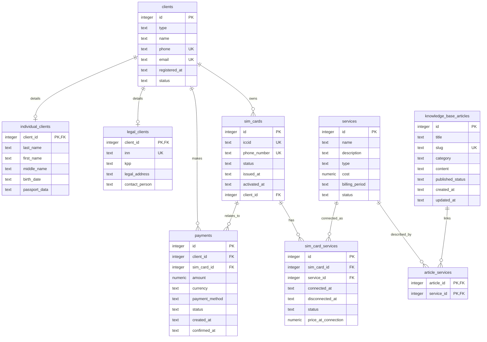

# ERD: Telecom SIM Cards

```mermaid
erDiagram
    clients ||--o| individual_clients : details
    clients ||--o| legal_clients : details
    clients ||--o{ sim_cards : owns
    clients ||--o{ payments : makes
    sim_cards ||--o{ payments : relates_to
    sim_cards ||--o{ sim_card_services : has
    services ||--o{ sim_card_services : connected_as
    services ||--o{ article_services : described_by
    knowledge_base_articles ||--o{ article_services : links

    clients {
        integer id PK
        text type
        text name
        text phone UK
        text email UK
        text registered_at
        text status
    }

    individual_clients {
        integer client_id PK,FK
        text last_name
        text first_name
        text middle_name
        text birth_date
        text passport_data
    }

    legal_clients {
        integer client_id PK,FK
        text inn UK
        text kpp
        text legal_address
        text contact_person
    }

    sim_cards {
        integer id PK
        text iccid UK
        text phone_number UK
        text status
        text issued_at
        text activated_at
        integer client_id FK
    }

    services {
        integer id PK
        text name
        text description
        text type
        numeric cost
        text billing_period
        text status
    }

    sim_card_services {
        integer id PK
        integer sim_card_id FK
        integer service_id FK
        text connected_at
        text disconnected_at
        text status
        numeric price_at_connection
    }

    payments {
        integer id PK
        integer client_id FK
        integer sim_card_id FK
        numeric amount
        text currency
        text payment_method
        text status
        text created_at
        text confirmed_at
    }

    knowledge_base_articles {
        integer id PK
        text title
        text slug UK
        text category
        text content
        text published_status
        text created_at
        text updated_at
    }

    article_services {
        integer article_id PK,FK
        integer service_id PK,FK
    }
```
