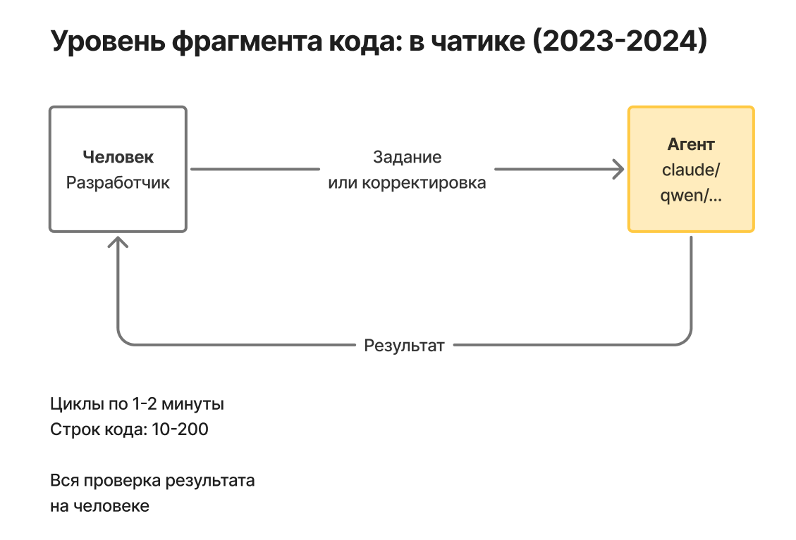
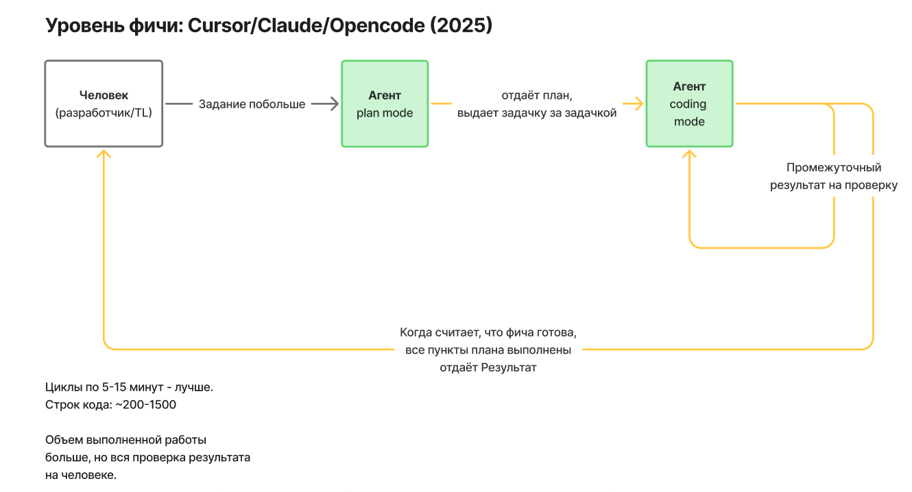
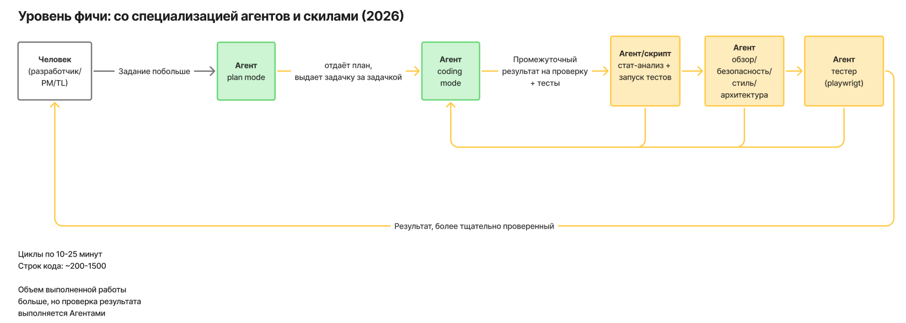
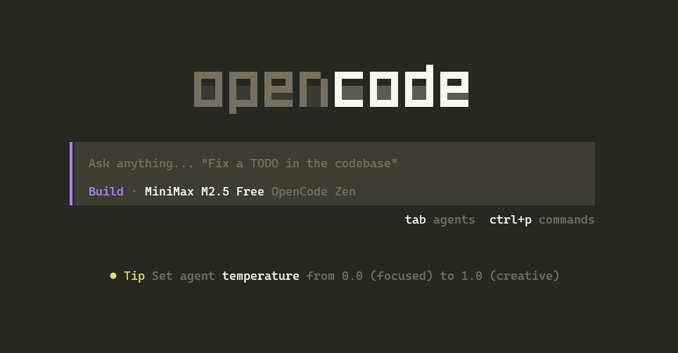

# Этап 1. Мышление Deepcoding

[← К roadmap](../README.md)

Цель: понять, что ИИ - не "магическая кнопка", а быстрый напарник, которому нужны рамки.

## Что нужно знать

- ИИ хорошо ускоряет рутину: поиск по проекту, генерацию шаблонов, тесты, документацию, рефакторинг.
- ИИ ошибается уверенно: может придумать API, сломать архитектуру или пропустить edge case.
- Разработчик остается владельцем решения.
- Чем точнее задача, контекст и критерий готовности, тем лучше результат.

## Простая формула реализации задачи

```md
Задача -> Контекст -> План -> Маленькая реализация -> Проверка -> Ревью -> Следующий шаг
```

## Этапы автоматизации

1. Обычный prompt в чате - разработчик сам формулирует задачу, дает контекст и проверяет ответ.



2. Уровень фичи - появляется агент-планировщик и coding agent: один помогает разложить задачу, второй вносит изменения маленькими шагами.



3. Итог курса - работа на уровне фичи со специализацией агентов, skills, документацией и субагентами вокруг разработки.



## Плохой запрос

```md
Сделай авторизацию.
```

## Хороший запрос

```md
Нужно добавить login по email/password в существующий Next.js проект.
Сначала найди текущую структуру auth, предложи план без изменений в коде.
Важно: не добавлять новые библиотеки без причины, использовать существующий Prisma client.
После плана жди подтверждения.
```

## Подготовка инструментов заранее

- Некоторые ИИ-инструменты, например Claude и Codex, недоступны из России без VPN. Заранее нужно подготовить личный или корпоративный VPN другой страны, чтобы не потерять время на старте.
- Поставить CLI-инструмент [OpenCode](https://opencode.ai/). Это open source AI coding agent для терминала, IDE и desktop-режима. В нем можно подключать разные модели и использовать бесплатные провайдеры с быстрыми бесплатными ИИ-моделями - этого достаточно для первых учебных задач.



- Используй браузерные мультимодальные чаты: туда можно загружать скриншоты, файлы, фрагменты кода, SQL-запросы, ТЗ задачи, диктовать голосом и получать в ответ не только текст, но и картинки или файлы.
- Хорошая бесплатная альтернатива как для старта, так и для продвинутой работы - [Qwen](https://chat.qwen.ai/). Его можно просить разобраться с ошибкой по скриншоту, объяснить чужой код, проверить SQL-запрос или помочь разложить задачу на шаги. Одна из лучших бесплатных альтернатив по моей оценке.
- Условно бесплатные чаты тоже полезны: Perplexity как сильный поисковик с LLM, ChatGPT/Codex для универсальной работы с текстом и кодом, а так же для анализа больших текстов и аккуратных объяснений.

## Домашнее задание

- Настроить VPN, если его еще нет
- Установить OpenCode CLI
- Выполнить `/init` внутри проекта через OpenCode CLI
- Попросить opencode рассказать про структуру вашего проекта
- Выполнить маленькую задачу из своего проекта.
