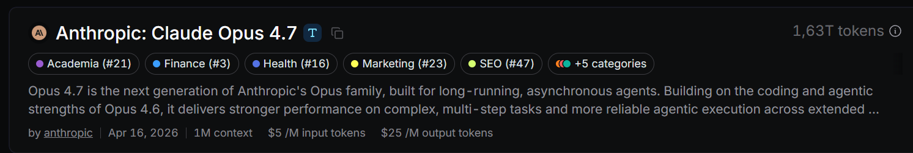
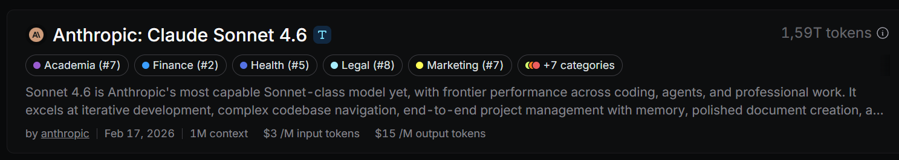
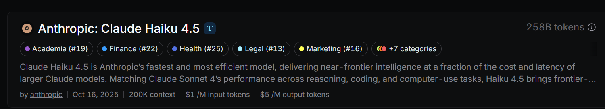
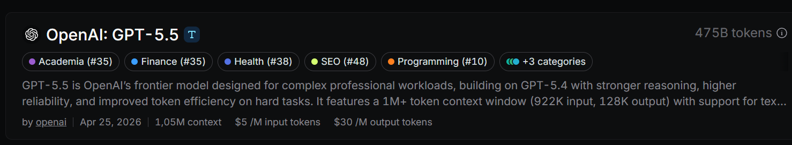
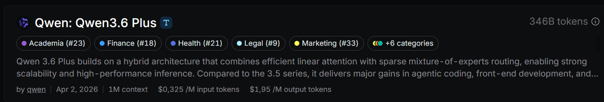
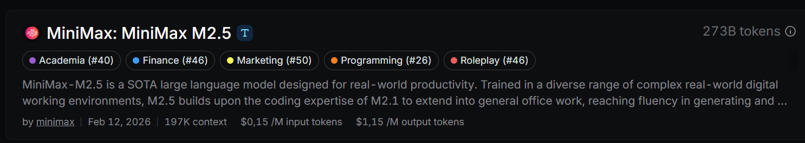

# Этап 2. Подготовка инструментов

[← К roadmap](../README.md)

Цель: ознакомиться и определиться с рабочей средой, где ИИ может не только отвечать на вопросы, но и работать с проектом.

## Основные инструменты

### Полноценные IDE

Полноценные IDE с ИИ являются самым удобным вариантом для работы с проектом за счет встроенного редактора кода, терминала, git, дебаггера, поиска по проекту и других инструментов. Из ИИ-преимуществ можно выделить такие вещи, как автодополнение кода, автоматическая генерация коммитов, удобная работа с перемещением файлов прямо в боковой чат и т.д.

- [Cursor](https://cursor.com/download) - IDE на основе VSCode с ИИ-агентами, правилами, контекстом, ревью и browser/debug режимами.
- [Antigravity](https://antigravity.google/download) - альтернативный вариант Cursor от Google, тоже на основе VSCode и с похожими возможностями.

Если сравнивать 2 этих инструмента, то Cursor является более удобным, так как большинство моделей внутри него не имеют региональных ограничений, а для использования Antigravity необходимо всегда работать с включенным VPN.

### Desktop-инструменты (программы, не имеющие встроенного редактора кода, но имеющие просмотр файлов проекта, лучше работать в связке с IDE)

- [Claude Code](https://claude.com/download) - сильный CLI-агент для работы в терминале.
- [Codex](https://developers.openai.com/codex/app) - агентная работа с кодом, задачами и репозиторием.

Подходит, если хочется разделить работу между двумя окнами: desktop-инструментом и IDE - в одной программе работает ИИ, в другой проверяется результат.

### Расширения для VSCode/Cursor

Является отличной альтернативной полноценных IDE, можно подключать различные расширения и видеть результат в редакторе кода и git.

Claude Code for VS CodeCodex – OpenAI’s coding agentQwen Code CompanionClineKilo Code: AI Coding Agent, Copilot, and Autocomplete

### CLI-инструменты (работа с проектами в терминале)

Стоит выбирать тем, кому важна скорость работы программы и независимость от привязки к конкретному редактору. Так же CLI инструменты универсальны и могут работать в любых терминалах и ОС.

Codex CLI

CLI инструменты удобно вызывать из терминала внутри IDE:

Codex CLI in VSCode

- Codex CLI
- Claude CLI
- QWEN CLI
- OpenCode CLI

## Оплата подписок

Подписки на Cursor/Claude/Codex официально оплатить российскими картами нельзя, поэтому их можно приобрести на сайтах торговых площадок, по типу [Plati Market](https://plati.market/), [GGSEL](https://ggsel.net/) и других. Либо можно оплачивать подписки банковскими картами других стран.

Основные правила при выборе подписки - рассматривать популярные варианты с большим количеством хороших отзывов, а так же с доступной для вас ценой.

Для старта работы достаточной базовой подписки:

- Pro для Cursor (в среднем 2000 рублей в месяц): дается месячный лимит на собственную модель `composer` + режим Auto и отдельный месячный лимит на использование других моделей (Claude, GPT, Gemini и др.)
- Plus для ChatGPT/Codex (в среднем 1900 рублей в месяц): даются недельные лимиты и пятичасовые лимиты на собственные модели `GPT`
- Pro для Claude (в среднем 2000 рублей в месяц): даются недельные лимиты и пятичасовые лимиты на собственные модели `Claude` и `Haiku`

Для `cursor` есть возможность выбрать оказание услуги оплатой подписки на существующий аккаунт в вашем сервисе, что является более дорогим вариантом, но позволяет сохранить ваши настройки аккаунта, такие как пользовательские правила для моделей. Так же есть возможность оплатить подписку на новый аккаунт в вашем сервисе, это уже дешевле, но придется переносить настройки и менять аккаунты каждый месяц.

## Токены и их стоимость

Токены - это единицы данных, которую понимает модель. Это не обязательно целое слово, а маленький кусочек текста, с которым работает модель.

### Input и Output токены

Input tokens — это всё, что вы отправили модели: вопрос, инструкция, контекст, история диалога.
Output токены - это токены, которые выводит модель.

Чем длиннее ваш запрос и чем длиннее ответ, тем больше токенов тратится.

### Почему ввод дешевле вывода

Обычно input дешевле output, потому что ввод модель просто читает один раз, а вывод должна генерировать по одному токену шаг за шагом

Генерация ответа требует больше вычислений: модель каждый новый токен строит на основе предыдущих, поэтому это дороже по времени и ресурсам.

### Почему одни модели дороже

Модель является более «прожорливой», когда у неё больше вычислений на каждый токен. На это влияют размер модели, число параметров, глубина архитектуры и длина контекста, который она держит в памяти.

Большие модели обычно лучше по качеству, но им нужно больше памяти и вычислений, поэтому они дороже.

Чем больше токенов в запросе и ответе, тем выше итоговая цена.

Наглядный пример стоимости токенов и разных по мощности моделей можем увидеть на сайте [OpenRouter](https://openrouter.ai/)

### Экономия токенов

Не всегда нужно использовать самую дорогую модель для решения всех задач. Использовать дорогие модели лучше в задачах проектирования архитектуры, планировании и когда нужна большая погруженность в контекст проекта. Более дешевые модели хорошо справляются с уже хорошо описанным планом либо с простыми задачами.

- Сильная модель: планирование, архитектура, сложный debug, ревью. (Claude Opus 4.7, GPT-5.5 High, Gemini 3.1 pro)
- Средняя модель: стандартные задачи, написание тестов, документации. (Claude Sonnet 4.6, Qwen 3.6 Plus, GPT-5.5 Medium)
- Дешевая модель: простейшие правки кода, реализация готового плана (Claude Haiku 4.5, GPT-5.5 Low, Qwen 3.6, Minimax M2.5, composer)

Пример связки: умная модель составляет план, более дешевая модель выполняет понятные шаги. Это экономит токены и деньги.

## Домашнее задание

- Установить минимум один агентный инструмент: Cursor, Claude Code или Codex.
- Решить вопрос с оплатой подписки