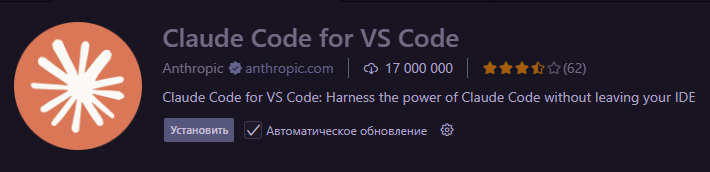
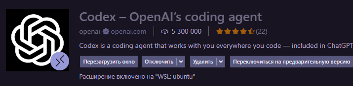
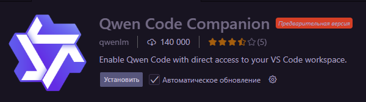
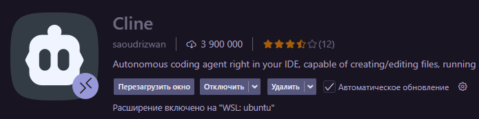
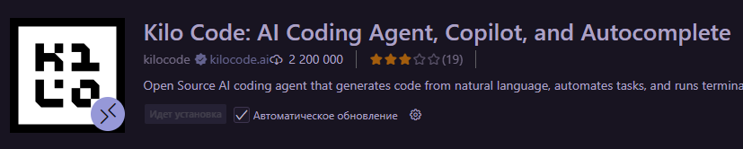
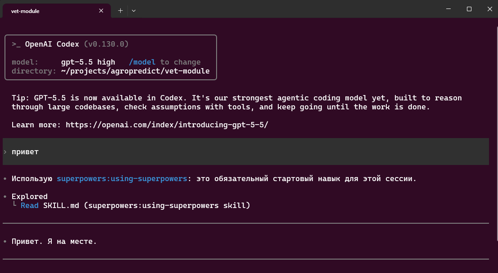
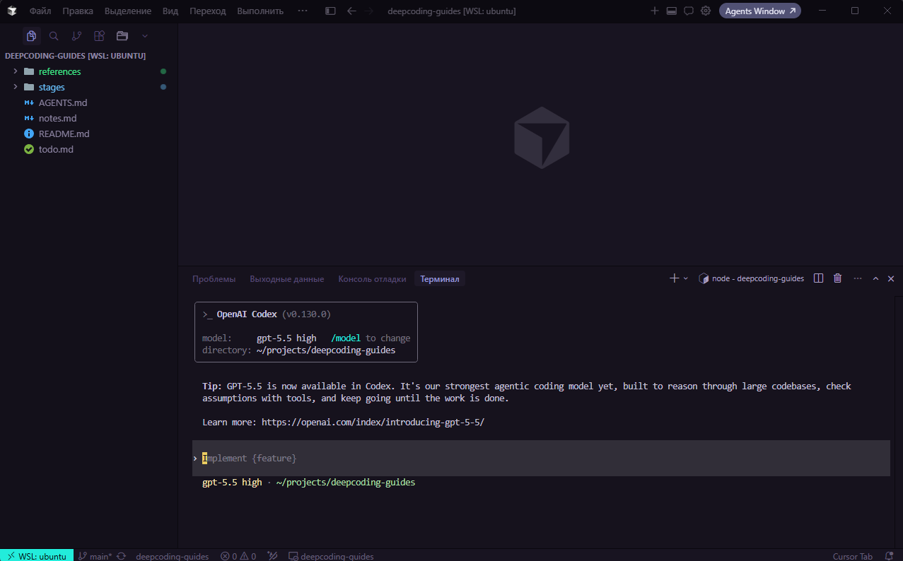
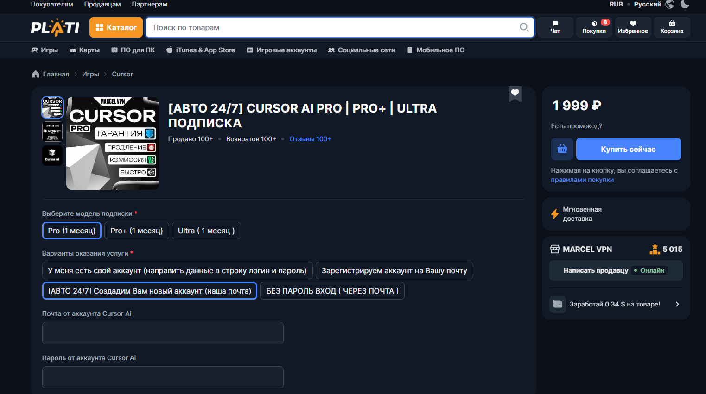

# Этап 2. Подготовка инструментов

[← К roadmap](../README.md)

Цель: ознакомиться и определиться с рабочей средой, где ИИ может не только отвечать на вопросы, но и работать с проектом.

## Основные инструменты

### Полноценные IDE

Полноценные IDE с ИИ являются самым удобным вариантом для работы с проектом за счет встроенного редактора кода, терминала, git, дебаггера, поиска по проекту и других инструментов. Из ИИ-преимуществ можно выделить такие вещи, как автодополнение кода, автоматическая генерация коммитов, удобная работа с перемещением файлов прямо в боковой чат и т.д.

- [Cursor](https://cursor.com/download) - IDE на основе VSCode с ИИ-агентами, правилами, контекстом, ревью и browser/debug режимами.
- [Antigravity](https://antigravity.google/download) - альтернативный вариант Cursor от Google, тоже на основе VSCode и с похожими возможностями.

### Desktop-инструменты (программы, не имеющие встроенного редактора кода, но имеющие просмотр файлов проекта, лучше работать в связке с IDE)

- [Claude Code](https://claude.com/download) - сильный CLI-агент для работы в терминале.
- [Codex](https://developers.openai.com/codex/app) - агентная работа с кодом, задачами и репозиторием.

Подходит, если хочется разделить работу между двумя окнами: desktop-инструментом и IDE - в одной программе работает ИИ, в другой проверяется результат.

### Расширения для VSCode/Cursor

Является отличной альтернативной полноценных IDE, можно подключать различные расширения и видеть результат в редакторе кода и git.

### CLI-инструменты (работа с проектами в терминале)

Стоит выбирать тем, кому важна скорость работы программы и независимость от привязки к конкретному редактору. Так же CLI инструменты универсальны и могут работать в любых терминалах и ОС.

CLI инструменты удобно вызывать из терминала внутри IDE:

- Codex CLI
- Claude CLI
- QWEN CLI
- OpenCode CLI

## Оплата подписок

Подписки на Cursor/Claude/Codex официально оплатить из России нельзя, поэтому их можно приобрести на сайиах торговых площадок, по типу [Plati Market](https://plati.market/), [GGSEL](https://ggsel.net/) и других.

Основные правила при выборе подписки - рассматривать популярные варианты с большим количеством хороших отзывов, а так же с доступной для вас ценой.

Для старта работы достаточной базовой подписки:

- Pro для Cursor (в среднем 2000 рублей в месяц): дается месячный лимит на собственную модель `composer` + режим Auto и отдельный месячный лимит на использование других моделей (Claude, GPT, Gemini и др.)
- Plus для ChatGPT/Codex (в среднем 1900 рублей в месяц): даются недельные лимиты и пятичасовые лимиты на собственные модели `GPT`
- Pro для Claude (в среднем 2000 рублей в месяц): даются недельные лимиты и пятичасовые лимиты на собственные модели `Claude` и `Haiku`

Есть возможность выбрать оказание услуги оплатой подписки на сущуствующий аккаунт в вашем сервисе, что является более дорогим вариантом, но позволяет сохранить ваши настройки аккаунта, такие как пользовательские правила для моделей. Так же есть возможность оплатить подписку на новый аккаунт в вашем сервисе, это уже дешевле, но придется переносить настройки и менять аккаунты каждый месяц.

## Токены и их стоимость

Токены - это единица измерения количества данных, которые используется для расчета стоимости использования модели.

Токены для русского языка:

- 1 токен = 4 символа
- 1 токен = 0.75 рублей

## Модели и стоимость

Не всегда нужно использовать самую дорогую модель. Для экономии токенов 

- Сильная модель: планирование, архитектура, сложный debug, ревью. (Claude Opus 4.7, GPT-5.5, Gemini 3.1 pro)
- Средняя модель: обычная реализация, тесты, документация.
- Дешевая модель: массовые правки, черновики, простые преобразования, реализация плана.

Пример связки: умная модель составляет план, более дешевая модель выполняет понятные шаги. Это экономит токены и деньги.

## Домашнее задание

- Установить минимум один агентный инструмент: Cursor, Claude Code или Codex.
- Решить вопрос с оплатой подписки
