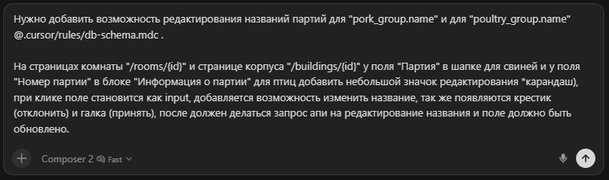

# Этап 4. Контекст проекта

[← К roadmap](../README.md)

Цель: научиться давать ИИ нужную информацию без мусора.

## Что такое контекст

Контекст - это все, что модель видит перед ответом: system-prompt, наш prompt, файлы, правила, скиллы, история чата, ошибки терминала, документация, тесты, issue, макеты, скриншоты.

Главное правило: контекст должен быть достаточным, но не раздутым.

## Что давать ИИ

- Цель задачи.
- Стек и версии.
- Важные файлы.
- Команды запуска.
- Ограничения.
- Примеры похожего кода.
- Ошибки из терминала.
- Ожидаемое поведение.

## Что не стоит давать

- Весь проект без причины.
- Длинные логи без ключевых строк.
- Устаревшие обсуждения.
- Секреты, токены, пароли.
- Несвязанные файлы "на всякий случай".

## Пример

```md
Нужно исправить баг в расчете скидки.
Смотри `app/services/discounts/*` и тесты `spec/services/discounts/*`.
Ожидаем: промокод не применяется к товарам категории GiftCard.
Сначала найди текущий расчет и предложи минимальный фикс.
```

## Пример промпта в реальном проекте с указанием ссылки на правило



## Важно

Решать конкретную задачу нужно в отдельном чате с ИИ, новую задачу решать в новом чате - если все решать в одном чате, то агент будет держать в голове весь прошлый контекст, который не относится к текущей задаче, из-за чего он будет раздутым и не эффективным, а так же будет быстрее тратить драгоценные токены.

Если прошлая задача косвенно связана с текущей либо контекст чата уже был переполнен, то попроси ИИ сгенерировать summary о прошлом реализованном функционале в отдельной md-файле и добавь его в контекст нового чата.

## Домашнее задание

- Выбрать баг или маленькую фичу.
- Дать ИИ только описание задачи.
- Потом дать описание + файлы + ошибку + ожидаемое поведение.
- Сравнить качество ответа.
